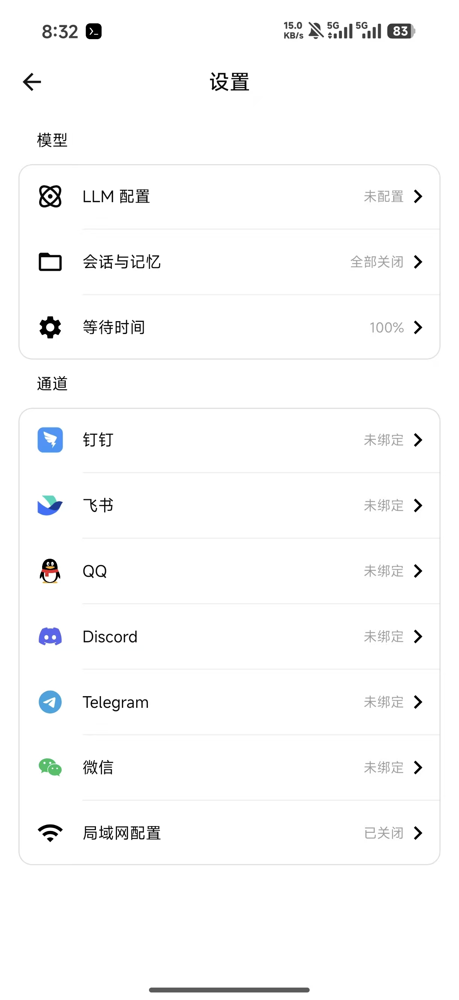
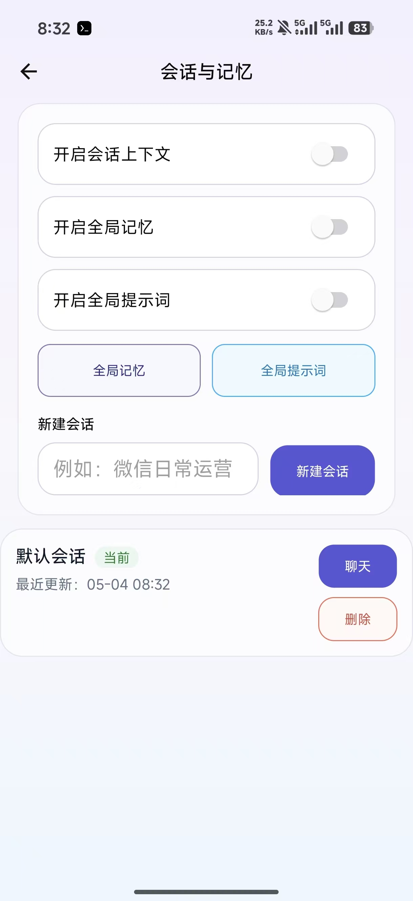
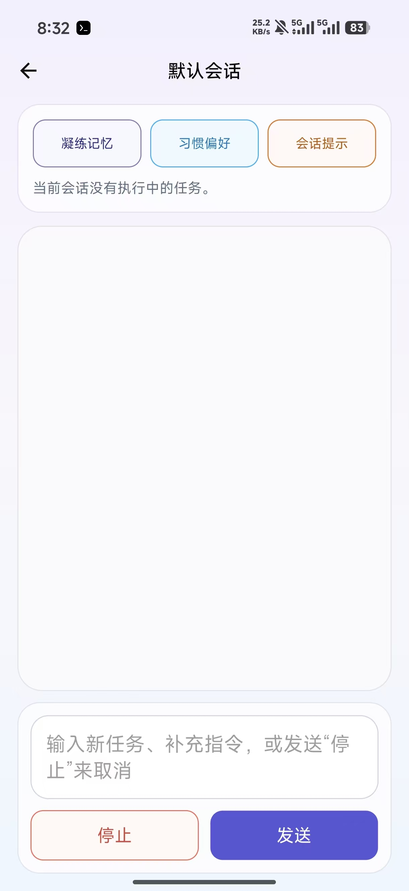
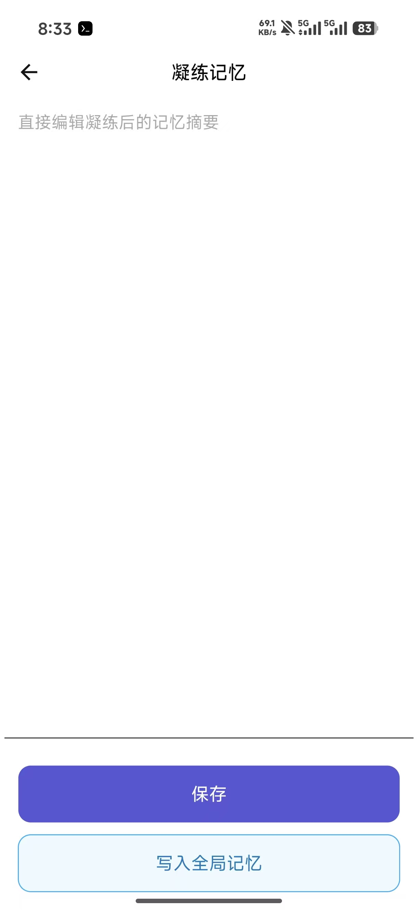
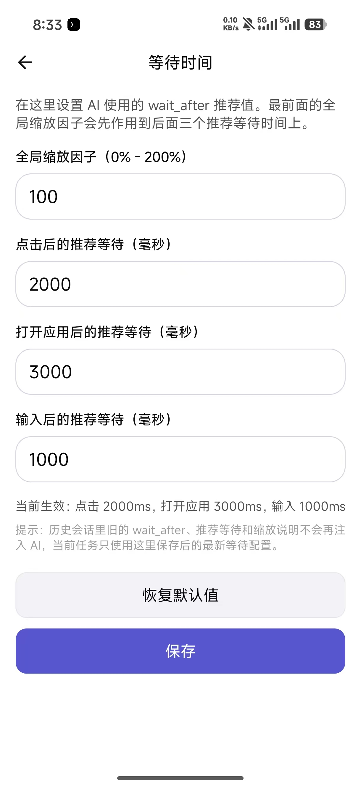
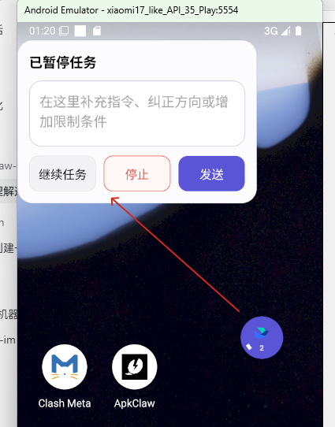

# ApkClaw Personal Enhanced Edition

> 基于 [apkclaw-team/ApkClaw](https://github.com/apkclaw-team/ApkClaw) 的个人增强版。向原项目作者和社区致敬，感谢他们把 Android 端 AI 自动化这个方向做成了可以运行、可以学习、可以继续改造的开源项目。

## 下载 APK

当前推荐版本：`v0.0.5`

## 这个仓库是什么

这是一个个人维护的 ApkClaw 衍生版本，核心能力仍来自原项目：

- Android AccessibilityService 驱动的手机自动化能力
- 通过钉钉、飞书、QQ、Discord、Telegram、微信等渠道接收自然语言任务
- 使用 LLM Agent 分析屏幕、调用工具、执行点击/滑动/输入/截图等操作
- OpenAI-compatible 与 Anthropic 模型接入
- 局域网配置页面、移动端设置页、前台服务和浮窗

这些基础能力和整体架构请优先阅读原项目文档：

[https://github.com/apkclaw-team/ApkClaw](https://github.com/apkclaw-team/ApkClaw)

本仓库的 README 只重点说明和原项目不同的部分。

## 和原项目的关系

本仓库不是 ApkClaw 官方仓库，也不代表原项目团队立场。它是在 Apache-2.0 许可下，对原项目进行二次修改和个人维护的版本。

关系说明：

- 原项目：`apkclaw-team/ApkClaw`
- 原项目地址：[https://github.com/apkclaw-team/ApkClaw](https://github.com/apkclaw-team/ApkClaw)
- 原项目许可证：Apache License 2.0
- 本仓库性质：个人增强版 / 衍生版本 / 非官方分支
- 本仓库保留原始 `LICENSE`，并在文档中明确说明修改内容

如果你只是想了解 ApkClaw 的基础设计、支持渠道、工具系统和基本使用方式，请先看原项目；如果你关心更长时间使用中的会话、记忆、暂停补充、等待时间调参和 DeepSeek V4 思考兼容，再看本仓库。

## 主要改动

相对上游 ApkClaw，本仓库目前重点增强了这些方向：

| 方向 | 本仓库新增或调整 |
| --- | --- |
| 版本与构建 | 版本升级到 `0.0.5`，新增 Windows debug 构建脚本 `build-debug.bat` / `build-debug.ps1` |
| 运行参数 | `maxIterations` 可在 App 内配置，不再固定写死 |
| 等待策略 | 新增等待时间设置页，可配置点击、打开应用、输入后的推荐等待时间和全局缩放 |
| 会话与记忆 | 新增本地 Session & Memory，支持会话上下文、全局记忆、全局提示词、会话切换和编辑 |
| 中途纠偏 | 新增浮窗暂停、继续、停止、补充指令能力；运行中发送普通补充会并入当前任务，发送类似“停止任务”的消息会立刻中断任务 |
| 飞书指令 | 飞书支持文本命令控制会话/记忆开关，以及新建、切换、查看当前会话 |
| 模型兼容 | 增加 DeepSeek V4 thinking 模式兼容，支持把 reasoning content 正确带回后续请求 |
| UI 体验 | 设置页、会话页、浮窗交互和多处中文文案做了更适合长期使用的调整 |

## 截图

<p align="center">
  
  
  
</p>

<p align="center">
  
  
  
  
</p>

## 我为什么改这些

原项目已经证明了“LLM 可以通过 Android 无障碍服务操作手机”。这个仓库更关注下一步：让它在真实、重复、容易被打断的使用场景里更顺手。

具体来说，这一版主要解决：

- 每次构建都依赖本机临时命令，发布前不够可复现
- Agent 最大迭代次数、等待时间等参数不方便调试
- 长任务之后缺少稳定的本地会话承接
- 历史记忆可能把过期的等待策略带进新任务
- 任务跑到一半时，用户只能停止重来，缺少“暂停后补一句”的交互
- DeepSeek V4 thinking 模式在工具调用链路里需要保留 reasoning content

## 快速开始

1. 从本仓库 GitHub Releases 下载 APK。
2. 安装到 Android 9+ 设备或模拟器。
3. 在 App 首页开启必要权限：无障碍服务、通知、悬浮窗、电池白名单、文件访问。
4. 在设置页填写 LLM 配置：`API Key`、`Base URL`、`Model Name`。
5. 配置至少一个消息渠道，或使用局域网配置页面辅助填写。
6. 通过已配置渠道发送自然语言任务。

任务运行中可以继续发送补充指令，普通补充会进入当前任务上下文；如果发送“停止任务”“取消任务”“终止任务”等明确停止含义的消息，当前任务会被立刻中断。

提示：这个应用会使用无障碍服务执行点击、滑动、输入、打开应用、卸载应用等操作。请只在你拥有或被授权操作的设备和账号上使用，并在涉及安装、卸载、删除、支付、转账等高影响操作时保持人工确认。

## 构建

Windows 下推荐使用仓库自带脚本：

```powershell
.\build-debug.bat
```

脚本会依次查找：

- `APKCLAW_JBR`
- `ANDROID_STUDIO_JBR`
- `JAVA_HOME`
- 常见 Android Studio JBR 路径

它会选择同时包含 `bin/java.exe` 和 `bin/jlink.exe` 的 JBR，并把 Gradle 固定到该运行时，减少不同机器上的构建差异。

也可以手动执行：

```powershell
.\gradlew.bat "-Dorg.gradle.java.home=E:\2.work\Android\Android Studio\jbr" assembleDebug
```

## DeepSeek V4 说明

DeepSeek V4 thinking 模式在工具调用场景下要求后续请求带回上一轮返回的 reasoning content。本仓库在 OpenAI-compatible 客户端中为 `deepseek-v4-pro` / `deepseek-v4-flash` 开启 thinking 回传，并在 Agent 历史消息里保留对应字段。

如果你使用 DeepSeek V4，请确认模型名使用服务端支持的标准写法，例如：

```text
deepseek-v4-pro
deepseek-v4-flash
```

## 风险与合规说明

这个项目属于 Android 自动化和 AI Agent 工具。请谨慎使用：

- 不要用于未授权设备、账号或应用场景。
- 不要用于刷量、骚扰、垃圾信息、绕过平台规则或其他违规用途。
- 使用第三方消息平台、模型服务、应用商店和系统镜像时，请遵守对应服务条款。
- LLM 可能误判屏幕内容或执行错误操作，重要操作前建议人工确认。
- 本版本具备在用户明确要求卸载应用时执行卸载的能力；在必要的任务路径中也可能进入卸载流程。请谨慎下达相关指令，避免误删仍需使用的应用或数据。
- 本仓库不声称与原项目团队、任何模型厂商、手机厂商或消息平台存在官方合作关系。

本项目按 Apache-2.0 许可和开源软件常见的 “AS IS” 方式提供，不提供任何明示或暗示担保。

## 发布前清单

发布到 GitHub 前建议确认：

- `LICENSE` 保留 Apache-2.0 原文。
- README 明确说明本仓库和原项目的关系。
- Release 页面上传 APK，不把 APK 直接提交进源码历史。
- Release 说明里附上 APK 文件名、版本号、SHA256。
- 不提交 `local.properties`、签名文件、API Key、机器人 Token、Android Studio 私有配置。
- 如未来修改包名、图标、应用名，应继续保留原项目致谢。

## 致谢

感谢 [apkclaw-team/ApkClaw](https://github.com/apkclaw-team/ApkClaw) 的原始工作。本仓库的大部分基础能力、项目结构和方向来自 ApkClaw；这里的改动是在它之上做的长期使用体验、会话记忆、构建和模型兼容增强。

也感谢 Android、LangChain4j、OkHttp、MMKV、NanoHTTPD 以及各消息平台 SDK 的开源生态。

## License

本仓库基于 Apache License 2.0 发布。详见 [LICENSE](LICENSE)。

原项目 ApkClaw 同样采用 Apache License 2.0。本仓库保留原许可文本，并在本文档中声明了二次修改关系和主要改动。
